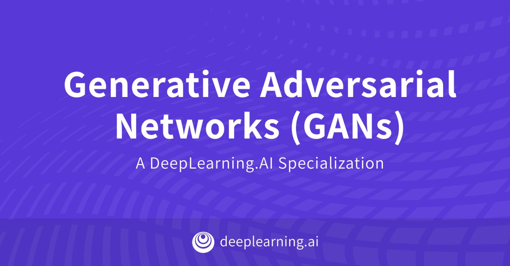

# Deeplearning.ai Generative Adversarial Networks Specialization
This repository contains my full work and notes on upcoming [Deeplearning.ai GAN Specialization](https://www.deeplearning.ai/generative-adversarial-networks-specialization/)
the GAN specialization has two courses which can be taken on Coursera. The two courses are:
1. [Course 1: Build Basic Generative Adversarial Networks]()
2. [Course 2: Build Better Generative Adversarial Networks]()
3. [Course 3: Apply Generative Adversarial Networks (GANs)]()

